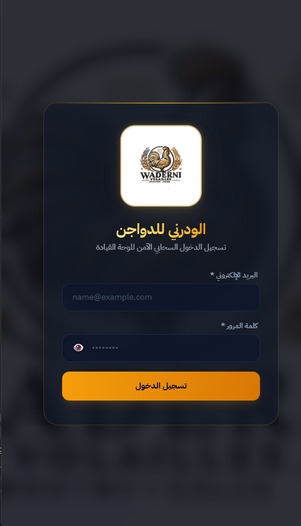
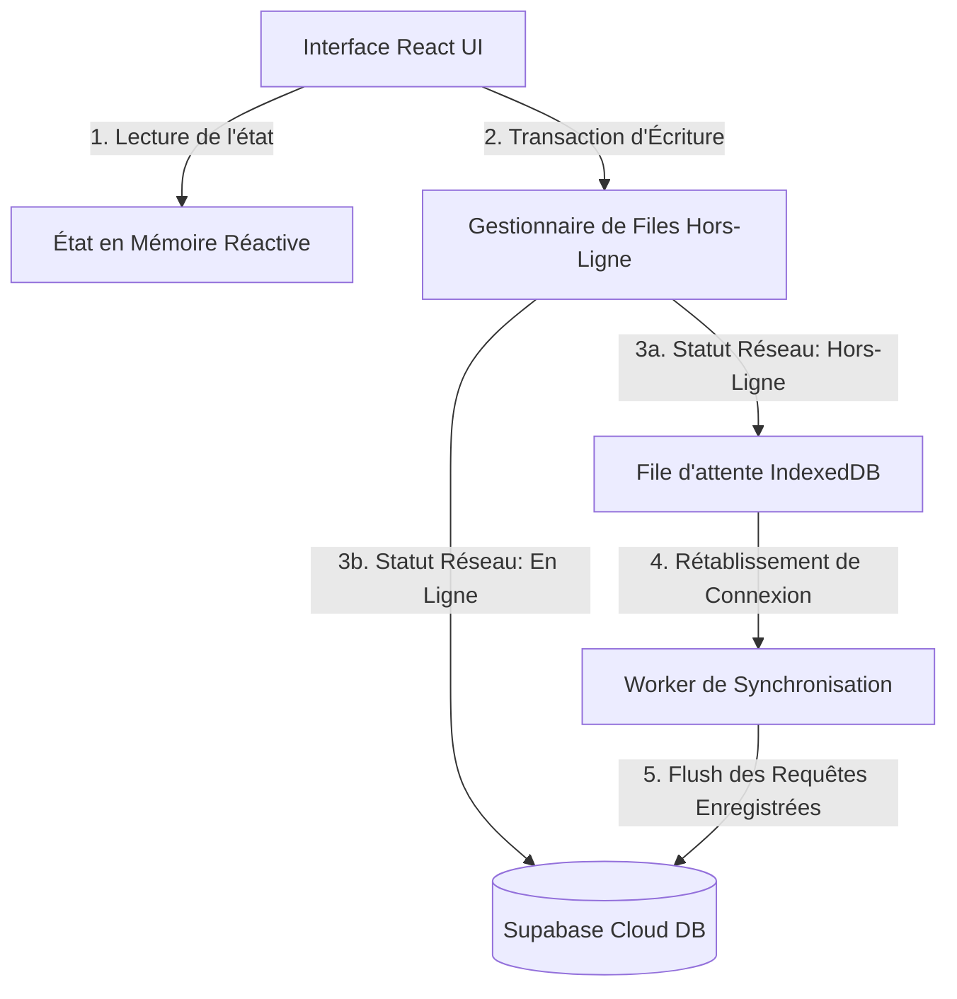

# 🐔 الودرني للدواجن — Poultry Ledger Pro

<p align="center">
  
</p>

<p align="center">
  <a href="https://react.dev"></a>
  <a href="https://vite.dev"></a>
  <a href="https://tailwindcss.com"></a>
  <a href="https://supabase.com"></a>
  <a href="#"></a>
  <a href="#"></a>
</p>

---

## 🌟 Présentation Générale

**Poultry Ledger Pro (الودرني للدواجن)** est une application cloud-native de classe entreprise, conçue spécifiquement pour la gestion logistique, comptable et financière des exploitations avicoles et des réseaux de distribution commerciale à fort volume.

Destinée aux exploitants et distributeurs du secteur avicole (notamment sur le marché tunisien), l'application comble le fossé entre le travail physique quotidien (souvent hors réseau dans les fermes) et le suivi comptable. Elle propose un écosystème robuste et complet pour enregistrer les transactions de vente et d'achat, calculer les poids nets au gramme près, gérer la trésorerie physique (Livre de Caisse), surveiller les dettes, imprimer des factures thermiques et sécuriser les données au moyen de technologies de pointe.

---

## 📸 Captures d'Écran & Interfaces

### 🔐 Portail d'Authentification Sécurisé
| Vue Bureau (Desktop) | Vue Mobile (Responsive) |
| :---: | :---: |
|  |  |

### 📊 Tableau de Bord Central
| Vue Bureau (Desktop) | Vue Mobile (Responsive) |
| :---: | :---: |
|  |  |

---

## 🎯 Fonctionnalités Clés & Expérience Premium

### 🎨 Design d'Élite & Immersion Visuelle
* **🏆 Palette Obsidian & Or (Golden Dark Mode)** : Thème sombre ultra-soigné combinant des fonds d'un noir obsidienne avec des accents dorés et ambrés chauds. Ce design a été optimisé pour réduire la fatigue oculaire lors des saisies nocturnes dans les hangars d'élevage.
* **🔮 Effets de Parallaxe 3D Atropos** : Cartes métriques et formulaires de connexion dotés d'interactions 3D gyroscopiques et réactives au survol de la souris pour un ressenti tactile unique.
* **🎬 Transitions Physiques Fluides** : Utilisation conjointe de **Framer Motion** et **React-Spring** pour des animations de pages fluides, des montages staggers et des micro-interactions de boutons naturelles basées sur la physique des ressorts.
* **🌐 Typographie Arabe IBM Plex Sans** : Intégration soignée de polices haute lisibilité optimisées pour l'arabe comptable de droite à gauche (RTL).
* **🌓 Modes Sombre / Clair Unifiés** : Basculement instantané s'adaptant aussi bien à la lumière éclatante du jour au bureau qu'à la pénombre des hangars.

### ⚡ Architecture Offline-First & Synchronisation
L'application résout définitivement les problèmes d'instabilité réseau typiques des environnements agricoles grâce à une base de données locale résiliente doublée d'un système de synchronisation intelligent.



* **IndexedDB Transactional Queue** : Chaque action (création de client, pesée de lot, écriture comptable, paiement) effectuée hors ligne est sérialisée et stockée localement dans le navigateur web via **IndexedDB**.
* **Atomic Dequeue & Retry** : Un worker d'arrière-plan surveille en continu la connexion (`navigator.onLine`). Dès le retour du réseau, il vide la file d'attente atomiquement vers Supabase avec dédoublonnement et résolution de conflits.
* **Hydratation Ultra-Rapide** : L'application démarre instantanément en chargeant l'état local avant de rafraîchir silencieusement les données depuis le cloud.

### ☁️ Sécurité Absolue & Cryptographie Zero-Knowledge
Pour préserver le secret professionnel de vos transactions financières, Poultry Ledger Pro intègre un coffre-fort de sauvegarde à chiffrement militaire côté client.
* **Cryptographie AES-GCM 256 bits** : Vos sauvegardes sont chiffrées localement dans votre navigateur à l'aide de l'API native `Web Crypto` (SubtleCrypto).
* **Dérivation de Clé Sécurisée** : La clé symétrique de chiffrement est dérivée à la volée en combinant le mot de passe utilisateur et un sel unique cryptographique par hachage **SHA-256**.
* **Zero-Knowledge Cloud Upload** : Les données sont envoyées sur les buckets Supabase sous la forme d'un blob binaire (`.bin`) entièrement crypté. Même les administrateurs de la base de données cloud ne peuvent lire le contenu de vos registres.

### ⌨️ Command Palette Clavier-Centrique (`Ctrl` + `K` / `Cmd` + `K`)
Conçue pour les comptables et opérateurs de saisie chevronnés, la boîte de recherche universelle permet de naviguer à la vitesse de l'éclair sans toucher à la souris.
* **Recherche Floue Intelligente** : Recherchez instantanément des clients, des fournisseurs, des actions système ou des pages.
* **Filtres Dédiés** : Isolez instantanément les entités (عملاء, موردين, إجراءات) grâce à des pilules de filtrage.
* **Raccourcis Clavier Supportés** :
  | Touches | Description de l'Action |
  | :--- | :--- |
  | <kbd>Ctrl + K</kbd> / <kbd>Cmd + K</kbd> | Ouvrir / Fermer la Command Palette |
  | <kbd>↑</kbd> et <kbd>↓</kbd> | Naviguer dans la liste des résultats |
  | <kbd>Enter ↩</kbd> | Exécuter l'action ou ouvrir la fiche sélectionnée |
  | <kbd>Esc</kbd> | Fermer la palette de recherche |

### 💵 Livre de Caisse & Trésorerie Courante (Cash Book)
Comprend un registre de caisse journalier complet pour auditer la trésorerie liquide de l'exploitation.
* **Consolidation Dynamique Auto** : Le système balaie l'intégralité du grand livre pour extraire les encaissements clients et les paiements fournisseurs du jour sélectionné.
* **Gestion des Frais Généraux** : Saisie manuelle des charges d'exploitation catégorisées (⛽ carburant/transport, 👥 salaires, 🌾 achat d'aliments, 🏠 loyer, ⚙️ autres).
* **Solde de Caisse Actuel** : Calcul automatique et instantané du solde initial reporté des jours précédents, du flux entrant/sortant, et de la encaisse physique en coffre.

### 🤝 Grand Livre des Fournisseurs & Achats (Purchases)
Gère l'approvisionnement global en amont de la chaîne de distribution.
* **Fiches Fournisseurs** : Registre d'adresses, coordonnées et tarification par défaut paramétrable pour chaque fournisseur de volaille.
* **Calcul des Marges de Poids** : Saisie précise du poids brut, de la tare (poids des cages vides) et du poids net facturé automatique.
* **Suivi de Balance d'Achats** : Calcul cumulé de la valeur totale achetée, des montants déjà réglés et de la dette active fournisseur.

### 📅 Échéancier Global des Règlements (Deadlines)
Assure le contrôle du risque client et de la solvabilité des comptes.
* **Limites de Crédit** : Alertes visuelles instantanées lorsque l'encours d'un client dépasse les seuils autorisés.
* **Tableau de Bord des Échéances** : Liste chronologique des traites, chèques et effets à encaisser ou à honorer (pending, paid, cancelled) avec notification visuelle des retards.

### 🖨️ Moteur d'Impression Thermique 80mm & PDF Vectoriels
* **Mise en page CSS `@media print`** : Factures et bilans configurés géométriquement pour s'adapter parfaitement aux rouleaux thermiques standard de 80mm.
* **Export PDF Haute Définition** : Génération instantanée et locale de PDF avec vectorisation propre en combinant `html2canvas` et `jsPDF` pour un téléchargement propre en un clic.

---

## 🛠️ Stack Technique Modernisé

| Couche applicative | Technologie | Rôle & Utilité |
| :--- | :--- | :--- |
| **Framework Core** | React 18.3.1 | Moteur d'interface réactif & gestionnaire d'état synchronisé |
| **Outil de Build** | Vite 8.0.14 | Compilation ES Modules ultra-rapide et Hot Module Replacement (HMR) |
| **Moteur CSS** | Tailwind CSS 3.4 & PostCSS | Architecture de styles utilitaires cohérente et adaptative |
| **Animations 3D** | Atropos 3.0 | Effets gyroscopiques et parallaxe 3D fluides |
| **Cinématique** | Framer Motion & React-Spring | Transitions douces et physiques réalistes |
| **Base de Données Cloud** | Supabase Cloud (Postgres 15) | Stockage SQL relationnel, gestion d'authentification et RLS |
| **Base Locale** | IndexedDB Browser Store | Gestion résiliente de la file d'attente hors ligne |
| **Moteur Document** | html2canvas & jsPDF | Rendu matriciel du DOM et packaging vectoriel PDF |

---

## 🗄️ Architecture de la Base de Données & Sécurité SQL

La sécurité et l'isolation des données d'entreprise sont appliquées au niveau le plus bas via le mécanisme de **Row Level Security (RLS)** sous PostgreSQL (Supabase).

```sql
-- =====================================================================
-- 1. PROFILES : Paramètres de l'entreprise
-- =====================================================================
CREATE TABLE IF NOT EXISTS public.profiles (
    id UUID PRIMARY KEY REFERENCES auth.users(id) ON DELETE CASCADE,
    company_name TEXT DEFAULT 'الودرني للدواجن' NOT NULL,
    company_address TEXT DEFAULT 'وادي النور الحامة,قابس',
    company_phone TEXT DEFAULT '96 101 651',
    company_tax_id TEXT DEFAULT '1895235/E',
    price_per_kg NUMERIC(6,3) DEFAULT 5.800 NOT NULL,
    created_at TIMESTAMP WITH TIME ZONE DEFAULT timezone('utc'::text, now()) NOT NULL
);

-- =====================================================================
-- 2. CLIENTS : Registre des acheteurs
-- =====================================================================
CREATE TABLE IF NOT EXISTS public.clients (
    id UUID PRIMARY KEY DEFAULT gen_random_uuid(),
    profile_id UUID NOT NULL REFERENCES public.profiles(id) ON DELETE CASCADE,
    name TEXT NOT NULL,
    address TEXT DEFAULT '—',
    phone TEXT DEFAULT '—',
    tax_id TEXT DEFAULT '-',
    notes TEXT DEFAULT NULL,
    color INTEGER DEFAULT 0 NOT NULL,
    created_at TIMESTAMP WITH TIME ZONE DEFAULT timezone('utc'::text, now()) NOT NULL
);

-- =====================================================================
-- 3. LEDGER ENTRIES : Journal quotidien des ventes et des poids
-- =====================================================================
CREATE TABLE IF NOT EXISTS public.ledger_entries (
    id UUID PRIMARY KEY DEFAULT gen_random_uuid(),
    client_id UUID NOT NULL REFERENCES public.clients(id) ON DELETE CASCADE,
    year INTEGER NOT NULL,
    month INTEGER NOT NULL,
    day INTEGER NOT NULL,
    total_weight NUMERIC(8,3) DEFAULT NULL,
    net_weight NUMERIC(8,3) DEFAULT NULL,
    price NUMERIC(6,3) DEFAULT NULL,
    amount NUMERIC(10,3) DEFAULT NULL,
    paid NUMERIC(10,3) DEFAULT NULL,
    holiday BOOLEAN DEFAULT false NOT NULL,
    notes TEXT DEFAULT NULL,
    updated_at TIMESTAMP WITH TIME ZONE DEFAULT timezone('utc'::text, now()) NOT NULL,
    CONSTRAINT unique_daily_entry_per_client UNIQUE(client_id, year, month, day)
);

-- =====================================================================
-- 4. SUPPLIERS : Registre des fournisseurs de volailles
-- =====================================================================
CREATE TABLE IF NOT EXISTS public.suppliers (
    id UUID PRIMARY KEY DEFAULT gen_random_uuid(),
    profile_id UUID NOT NULL REFERENCES public.profiles(id) ON DELETE CASCADE,
    name TEXT NOT NULL,
    address TEXT DEFAULT '—',
    phone TEXT DEFAULT '—',
    tax_id TEXT DEFAULT '-',
    notes TEXT DEFAULT NULL,
    color INTEGER DEFAULT 0 NOT NULL,
    created_at TIMESTAMP WITH TIME ZONE DEFAULT timezone('utc'::text, now()) NOT NULL
);

-- =====================================================================
-- 5. PURCHASES : Journal quotidien des achats
-- =====================================================================
CREATE TABLE IF NOT EXISTS public.purchases (
    id UUID PRIMARY KEY DEFAULT gen_random_uuid(),
    supplier_id UUID NOT NULL REFERENCES public.suppliers(id) ON DELETE CASCADE,
    year INTEGER NOT NULL,
    month INTEGER NOT NULL,
    day INTEGER NOT NULL,
    total_weight NUMERIC(8,3) DEFAULT NULL,
    net_weight NUMERIC(8,3) DEFAULT NULL,
    price NUMERIC(6,3) DEFAULT NULL,
    amount NUMERIC(10,3) DEFAULT NULL,
    paid NUMERIC(10,3) DEFAULT NULL,
    holiday BOOLEAN DEFAULT false NOT NULL,
    notes TEXT DEFAULT NULL,
    updated_at TIMESTAMP WITH TIME ZONE DEFAULT timezone('utc'::text, now()) NOT NULL,
    CONSTRAINT unique_daily_purchase_per_supplier UNIQUE(supplier_id, year, month, day)
);

-- =====================================================================
-- 6. DEADLINES : Échéancier de paiements (Dettes et traites clients/fournisseurs)
-- =====================================================================
CREATE TABLE IF NOT EXISTS public.deadlines (
    id UUID PRIMARY KEY DEFAULT gen_random_uuid(),
    profile_id UUID NOT NULL REFERENCES public.profiles(id) ON DELETE CASCADE,
    client_id UUID REFERENCES public.clients(id) ON DELETE CASCADE,
    supplier_id UUID REFERENCES public.suppliers(id) ON DELETE CASCADE,
    amount NUMERIC(10,3) NOT NULL CHECK (amount > 0),
    due_date DATE NOT NULL,
    status TEXT NOT NULL DEFAULT 'pending' CHECK (status IN ('pending', 'paid', 'cancelled')),
    notes TEXT DEFAULT NULL,
    created_at TIMESTAMP WITH TIME ZONE DEFAULT timezone('utc'::text, now()) NOT NULL,
    updated_at TIMESTAMP WITH TIME ZONE DEFAULT timezone('utc'::text, now()) NOT NULL,
    CONSTRAINT deadline_target_check CHECK (
        (client_id IS NOT NULL AND supplier_id IS NULL) OR 
        (client_id IS NULL AND supplier_id IS NOT NULL)
    )
);
```

### Architecture de Sécurité (RLS) & Triggers Avancés
* **Isolation stricte** : Aucun utilisateur ne peut lire ou modifier les enregistrements d'une autre entreprise. La fonction SQL `auth.uid()` est comparée au champ `profile_id` ou validée récursivement par des sous-requêtes :
```sql
CREATE POLICY "Users can view ledger entries of their own clients."
    ON public.ledger_entries FOR SELECT
    USING (
        EXISTS (
            SELECT 1 FROM public.clients 
            WHERE public.clients.id = public.ledger_entries.client_id 
            AND public.clients.profile_id = auth.uid()
        )
    );
```
* **Automatisation à l'inscription** : Un trigger PL/pgSQL intercepte l'inscription d'un nouvel utilisateur dans Supabase Auth pour instancier instantanément sa fiche d'entreprise par défaut dans la table publique :
```sql
CREATE OR REPLACE FUNCTION public.handle_new_user()
RETURNS trigger AS $$
BEGIN
    INSERT INTO public.profiles (id, company_name, company_address, company_phone, company_tax_id, price_per_kg)
    VALUES (new.id, 'الودرني للدواجن', 'وادي النور الحامة,قابس', '96 101 651', '1895235/E', 5.800);
    RETURN new;
END;
$$ LANGUAGE plpgsql SECURITY DEFINER;
```

---

## 🚀 Installation & Lancement en Local

### 📋 Prérequis nécessaires
Vérifiez que les outils suivants sont installés sur votre poste de travail :
* **Node.js** (Version 20 ou supérieure recommandée)
* **npm** (Version 10 ou supérieure)

### ⚙️ Guide d'installation étape par étape

1. **Cloner le dépôt Git** :
   ```bash
   git clone https://github.com/mormox2/poultry-ledger.git
   cd poultry-ledger
   ```

2. **Installer les dépendances** :
   > [!IMPORTANT]
   > En raison de conflits stricts de dépendances avec les packages React 18 et Atropos d'animations, veuillez exécuter l'installation avec le flag des pairs hérités :
   ```bash
   npm install --legacy-peer-deps
   ```

3. **Configurer les variables d'environnement** :
   Créez un fichier `.env` à la racine du projet en vous basant sur le modèle fourni :
   ```bash
   cp .env.example .env
   ```
   Renseignez les clés publiques d'API de votre instance active Supabase :
   ```env
   VITE_SUPABASE_URL=https://votre-projet-id.supabase.co
   VITE_SUPABASE_ANON_KEY=votre-cle-api-publique-anonyme
   ```

4. **Lancer le serveur de développement local** :
   ```bash
   npm run dev
   ```
   Ouvrez votre navigateur sur l'adresse retournée dans votre terminal (généralement `http://localhost:3000` ou `http://localhost:5173`).

5. **Compiler pour la production** :
   Pour packager l'application en vue d'un déploiement sur un CDN statique à haute performance :
   ```bash
   npm run build
   ```
   Les fichiers statiques optimisés et minifiés seront créés dans le répertoire `/dist`.

---

## 🌐 Intégration Continue & Déploiement (CI/CD)

Le projet intègre un pipeline entièrement automatisé au moyen de **GitHub Actions** situé dans le fichier [.github/workflows/deploy.yml](file:///.github/workflows/deploy.yml).

À chaque commit fusionné sur la branche principale `main` :
1. Un runner virtuel standardise l'environnement Node.js.
2. Les dépendances sont installées avec contournement strict des conflits de pairs.
3. Le code de l'application Single-Page (SPA) est packagé et optimisé.
4. L'application est instantanément déployée et rendue accessible sur **GitHub Pages**.

---

## 📄 Licence
Ce projet est distribué sous la licence **MIT**. Consulter le fichier [LICENSE](file:///c:/Users/user/Documents/GitHub/poultry-ledger/LICENSE) pour plus d'informations.

---

<p align="center" style="font-weight: bold; color: #f59e0b;">
  🐔 Dawajin Pro — La gestion avicole réinventée avec excellence.
</p>
