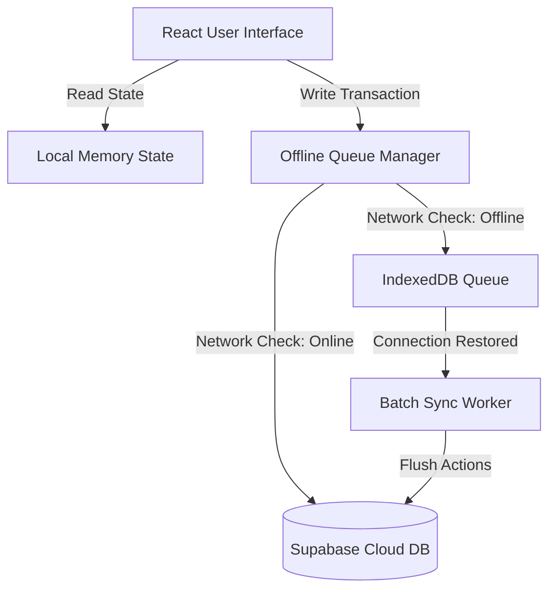

# 🐔 الودرني للدواجن — Poultry Ledger Pro

Poultry Ledger Pro (**الودرني للدواجن**) is a state-of-the-art, premium cloud-native ledger application designed specifically for high-volume commercial poultry farm management and distribution logistics. Built to handle daily logistics, deliveries, weights, and client invoicing, the application bridges the gap between active field work and reliable financial accounting. 

Featuring an **offline-first database architecture**, interactive **3D glassmorphic UI widgets**, **high-fidelity analytics charts**, and an automated **hardware-direct thermal receipt generation engine**, Poultry Ledger Pro ensures your agricultural enterprise remains synchronized, transparent, and functional in any environment.

---

## 📸 App Previews & Interface

### 🔐 Authentication Portal
| Desktop View | Mobile View |
| :---: | :---: |
|  |  |

### 📊 Management Dashboard
| Desktop View | Mobile View |
| :---: | :---: |
|  |  |

---

## 🎨 Premium Visual Experience

The application is meticulously designed to provide an elite user experience combining modern digital design trends with seamless functionality:

*   **🏆 Custom Golden Dark Aesthetics**: A premium color palette consisting of dark obsidian backgrounds and warm gold/amber accents, specifically designed to reduce eye strain during late-night farm operations.
*   **🔮 Atropos 3D Parallax Interactions**: Sleek, responsive 3D card tilts on dashboard metrics and the authentication portal, giving a tactile depth to quantitative data.
*   **🎬 Fluid Framer Motion & React-Spring Transitions**: Dynamic stagger animations, smooth page-level mounting, and reactive micro-interactions on button hovers, toggles, and input states.
*   **🌐 Native IBM Plex Sans Arabic Typography**: Custom font loading and dedicated text-alignment properties tailored for high-readability Right-to-Left (RTL) Arabic accounting.
*   **🌓 Unified Dark/Light Modes**: Instantly toggleable aesthetic layouts allowing seamless transitions between low-light barn management and bright-daylight office environments.

---

## ⚡ Offline-First Architecture & Synchronization

Agricultural and field environments often suffer from unstable network conditions. Poultry Ledger Pro addresses this through an **Offline-First Bridging Database Architecture**:



### Key Technical Aspects:
1.  **IndexedDB Sync Queue**: Any database operation (creating clients, updating ledger values, record deletion) performed while offline is automatically serialized and queued in browser-level **IndexedDB** storage.
2.  **Atomic Dequeue & Retry**: A background sync worker continuously monitors network connectivity (`navigator.onLine`). When internet access is restored, it atomically flushes the IndexedDB queue to Supabase, performing automatic deduplication and conflict resolution.
3.  **Local State Hydration**: On initial boot, the app loads from the local store first to ensure instantaneous render times, followed by an asynchronous background sync to fetch the latest cloud changes.

---

## 🖨️ Thermal Receipt Printing & PDF Engine

Client transactions are concluded with direct-to-hardware responsive receipt styling:

*   **Responsive 80mm Layouts**: Invoices are designed with pure CSS `@media print` rules mapped exactly to standard 80mm commercial thermal paper rolls.
*   **Dynamic Document Export**: High-fidelity local document printing utilizing `html2canvas` for precise layout rendering and `jspdf` for instantaneous, downloadable PDF invoices.
*   **Detailed Sales Breakdown**: Every invoice itemizes:
    *   Gross weight, tare weight, net weight (calculated to three decimal places)
    *   Dynamic client-specific rates (Tunisian Dinar `TND` format using `fr-TN` locale formats)
    *   Previous outstanding balances and new calculated debt ratios

---

## 📊 Deep Analytics & Financial Auditing

Gain absolute clarity on your farm's performance with integrated business intelligence tools:

*   **Key Performance Indicators (KPIs)**: Instantly track total gross sales, cash received, outstanding credits, net weight shipped, and collection ratios.
*   **Client Market Share Donuts**: Interactive SVG ring gauges depicting proportional distributions of monthly orders across your client base.
*   **Historical Performance Charts**: High-performance SVG-drawn vector line graphs showcasing daily delivery weight fluctuations and payment collection trends over time.
*   **Outstanding Debt Tracking**: Real-time alerts displaying client debt limits and color-coded lists flagging high-exposure profiles.

---

## 🛠️ Technology Stack

| Layer | Technology | Purpose |
| :--- | :--- | :--- |
| **Core Framework** | React 18.3 | Reactive client interface & state synchronization |
| **Build & Tooling** | Vite 8.0 & ES Modules | High-speed hot module replacement and compilation |
| **Styling Engine** | Tailwind CSS 3.4 | Consistent styling utility classes & design language |
| **3D Animations** | Atropos 3D | High-end GPU-accelerated cursor parallax card effects |
| **Micro-Animations** | Framer Motion & React-Spring | Natural spring-physics based layout transitions |
| **Cloud Database** | Supabase SDK | Postgres database backend, authentication, and RLS |
| **Local Storage** | IndexedDB | Resilient transactional queuing for offline operations |
| **Document Export** | html2canvas & jsPDF | Client-side DOM rasterization & vector PDF packaging |

---

## 🗄️ Database Schema & Row-Level Security

Poultry Ledger Pro operates under **Row Level Security (RLS)** in PostgreSQL to isolate corporate data. The complete schema definition is detailed below:

```sql
-- Profiles table (Stores user company settings and base pricing)
CREATE TABLE IF NOT EXISTS public.profiles (
    id UUID PRIMARY KEY REFERENCES auth.users(id) ON DELETE CASCADE,
    company_name TEXT DEFAULT 'الودرني للدواجن' NOT NULL,
    company_address TEXT DEFAULT 'وادي النور الحامة,قابس',
    company_phone TEXT DEFAULT '96 101 651',
    company_tax_id TEXT DEFAULT '1895235/E',
    price_per_kg NUMERIC(6,3) DEFAULT 5.800 NOT NULL,
    created_at TIMESTAMP WITH TIME ZONE DEFAULT timezone('utc'::text, now()) NOT NULL
);

-- Clients registry table
CREATE TABLE IF NOT EXISTS public.clients (
    id UUID PRIMARY KEY DEFAULT gen_random_uuid(),
    profile_id UUID NOT NULL REFERENCES public.profiles(id) ON DELETE CASCADE,
    name TEXT NOT NULL,
    address TEXT DEFAULT '—',
    phone TEXT DEFAULT '—',
    tax_id TEXT DEFAULT '-',
    notes TEXT DEFAULT NULL,
    color INTEGER DEFAULT 0 NOT NULL,
    created_at TIMESTAMP WITH TIME ZONE DEFAULT timezone('utc'::text, now()) NOT NULL
);

-- Daily Ledger entries table
CREATE TABLE IF NOT EXISTS public.ledger_entries (
    id UUID PRIMARY KEY DEFAULT gen_random_uuid(),
    client_id UUID NOT NULL REFERENCES public.clients(id) ON DELETE CASCADE,
    year INTEGER NOT NULL,
    month INTEGER NOT NULL,
    day INTEGER NOT NULL,
    total_weight NUMERIC(8,3) DEFAULT NULL,
    net_weight NUMERIC(8,3) DEFAULT NULL,
    price NUMERIC(6,3) DEFAULT NULL,
    amount NUMERIC(10,3) DEFAULT NULL,
    paid NUMERIC(10,3) DEFAULT NULL,
    holiday BOOLEAN DEFAULT false NOT NULL,
    notes TEXT DEFAULT NULL,
    updated_at TIMESTAMP WITH TIME ZONE DEFAULT timezone('utc'::text, now()) NOT NULL,
    CONSTRAINT unique_daily_entry_per_client UNIQUE(client_id, year, month, day)
);
```

### Row Level Security (RLS) Policy Architecture
All user profiles, client cards, and transactional entries are strictly isolated using PostgreSQL session contexts (`auth.uid()`):

*   **Profile Access**: Restricted exclusively to the authenticated account owner.
*   **Client Records**: Can only be selected, inserted, updated, or deleted if `auth.uid() = profile_id`.
*   **Ledger Security**: Validated via conditional subqueries ensuring the client is registered under the current active user profile:
    ```sql
    CREATE POLICY "Users can view ledger entries of their own clients."
        ON public.ledger_entries FOR SELECT
        USING (
            EXISTS (
                SELECT 1 FROM public.clients 
                WHERE public.clients.id = public.ledger_entries.client_id 
                AND public.clients.profile_id = auth.uid()
            )
        );
    ```
*   **Automatic Profile Creation**: A secure Pl/pgSQL trigger invokes whenever a new user completes email/password sign-up, instantly spawning their business profile table:
    ```sql
    CREATE OR REPLACE FUNCTION public.handle_new_user()
    RETURNS trigger AS $$
    BEGIN
        INSERT INTO public.profiles (id, company_name, company_address, company_phone, company_tax_id, price_per_kg)
        VALUES (new.id, 'الودرني للدواجن', 'وادي النور الحامة,قابس', '96 101 651', '1895235/E', 5.800);
        RETURN new;
    END;
    $$ LANGUAGE plpgsql SECURITY DEFINER;
    ```

---

## 🚀 Installation & Local Environment Setup

### 📋 Prerequisites
Ensure you have the following installed on your machine:
*   [Node.js](https://nodejs.org/) (Version 20+ recommended)
*   [npm](https://www.npmjs.com/) (Version 10+)

### ⚙️ Step-by-Step Installation

1.  **Clone the repository**:
    ```bash
    git clone https://github.com/mormox2/poultry-ledger.git
    cd poultry-ledger
    ```

2.  **Install dependencies**:
    Due to strict dependency resolution in React 18 / Atropos packages, execute the install using legacy peer flags:
    ```bash
    npm install --legacy-peer-deps
    ```

3.  **Set up Environment Variables**:
    Create a `.env` file in the root directory by copying the template:
    ```bash
    cp .env.example .env
    ```
    Populate the file with your active Supabase project keys:
    ```env
    VITE_SUPABASE_URL=https://your-supabase-project-id.supabase.co
    VITE_SUPABASE_ANON_KEY=your-supabase-anonymous-public-api-key
    ```

4.  **Launch the development server**:
    ```bash
    npm run dev
    ```
    Open your browser and navigate to `http://localhost:3000` or the address displayed in your terminal.

5.  **Compile static production assets**:
    ```bash
    npm run build
    ```
    Compiled output will be generated in the `/dist` directory, optimized for immediate deployment to static web hosts.

---

## 🌐 Continuous Integration & Deployment (CI/CD)

The application implements a robust, automated pipeline via **GitHub Actions** located at [.github/workflows/deploy.yml](file:///.github/workflows/deploy.yml).

Every commit pushed to the `main` branch automatically triggers the workflow to:
1.  Initialize a standard node environment.
2.  Install dependencies safely bypassing standard strict conflict resolution using peer-dep handling.
3.  Build and optimize the single-page application (SPA).
4.  Deploy the built assets directly to **GitHub Pages** for instant production access.
